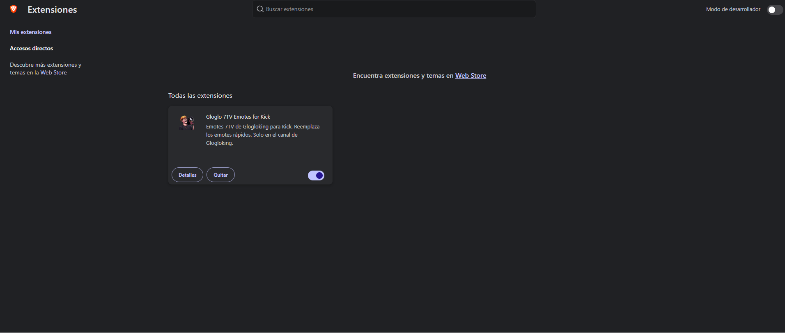
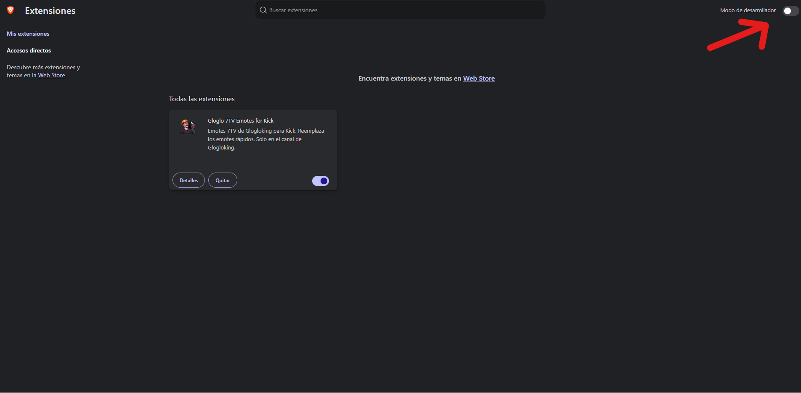
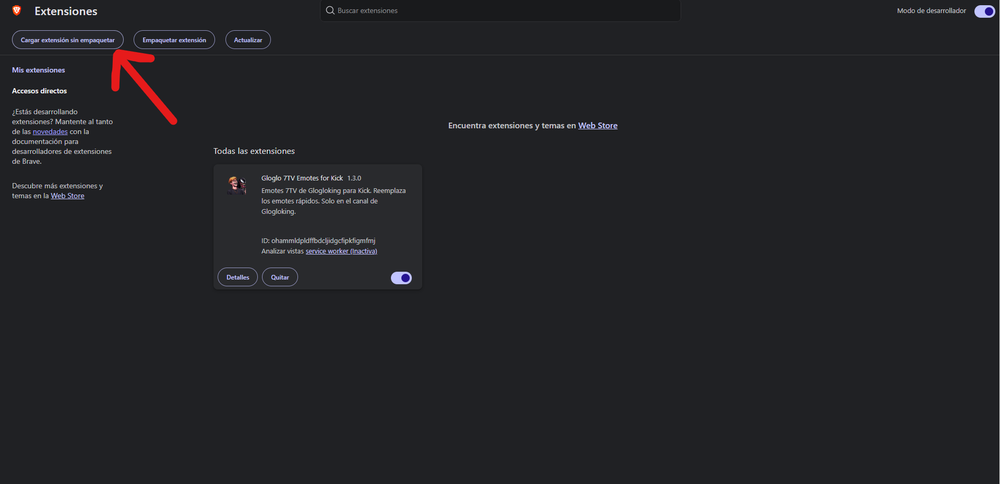
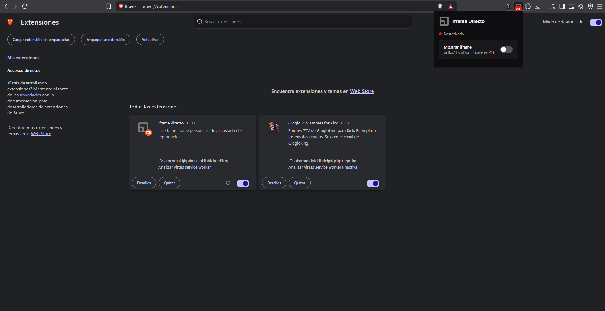

# iframe-directo

---

## Descarga e instalación

### 1. Descarga el archivo ZIP

🔗 **[Descargar iframe-directo.zip](https://github.com/codewerl-hash/Iframe-directo/releases/download/v1.3/iframe-directo.zip)**

> Reemplaza el link anterior por el enlace real de descarga cuando esté disponible.

### 2. Descomprime el archivo

Una vez descargado, descomprime el ZIP en una carpeta de tu computadora.

> **Importante:** no borres la carpeta después de cargarla en Chrome; la extensión la necesita para funcionar.

### 3. Abre las extensiones de Chrome

En la barra de direcciones escribe:

```
chrome://extensions/
```


### 4. Activa el modo desarrollador

En la esquina superior derecha activa el interruptor **"Modo de desarrollador"** o **"Developer mode"**.



### 5. Carga la extensión

1. Haz clic en **"Cargar descomprimida"** o **"Load unpacked"**.
2. Selecciona la carpeta `iframe-directo/` que descomprimiste.
3. La extensión aparecerá en la lista.



### 6. Fíjala en la barra

1. Haz clic en el ícono de piezas 🧩 al lado de la barra de direcciones.
2. Busca **iframe-directo**.
3. Haz clic en el chinche 📌 para dejarla visible siempre.
   


---

## Cómo usar

### Activar el iframe

1. La persona encargada del canal debe activar primero la URL del iframe desde el panel de administración.
2. Espera unos segundos a que se aplique el cambio.
3. Haz clic en el ícono de **iframe-directo** en la barra.
4. Activa el interruptor.
5. El reproductor principal se cambiará por el iframe y el stream original quedará como ventana pequeña arriba del chat.

### Desactivar el iframe

1. Haz clic en el ícono de **iframe-directo** en la barra.
2. Desactiva el interruptor.
3. Recarga la página de Kick (`F5`) para volver a la vista normal.

---


